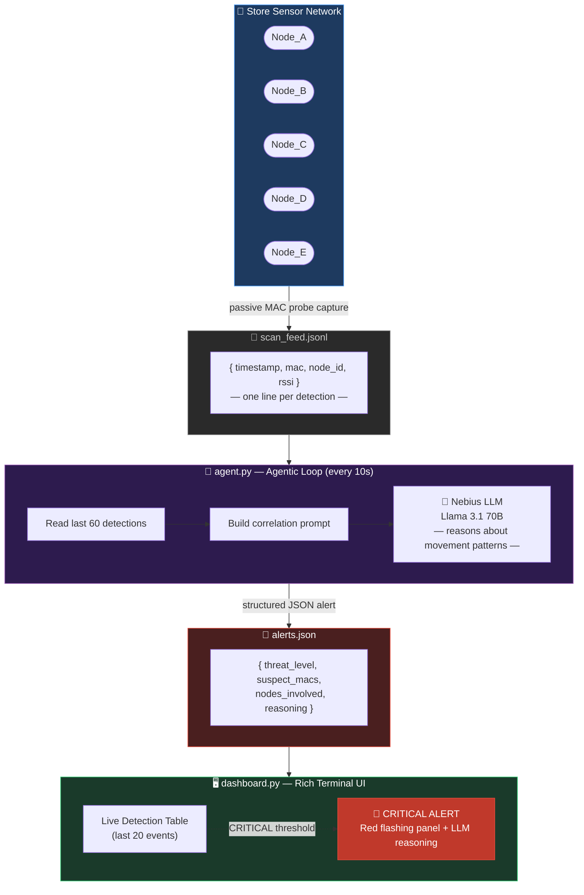

# 🛡️ The Autonomous SIGINT Sentinel

> **AI-powered edge threat detection for coordinated retail theft — built on Nebius AI**

[](https://python.org)
[](https://nebius.com)
[](https://nebius.com)
[]()

---

## 🔍 What Is This?

Retail theft costs the industry **over $100 billion per year**. A growing tactic is the *coordinated booster ring* — groups of 3–5 people who move through a store in tight synchronization to overwhelm floor staff and cameras.

**The SIGINT Sentinel** detects these groups in real time by passively monitoring **Wi-Fi and Bluetooth probe requests** emitted by the personal devices every person already carries. When multiple devices move in synchronized patterns across sensor nodes, the system triggers an AI-powered threat analysis.

No cameras. No biometrics. **Just signals, math, and reasoning.**

---

## 🧠 How It Works



The system runs an **agentic loop**: detections stream in → the LLM reasons about movement correlation → structured alerts are written → the terminal dashboard responds in real time.

---

## ✨ Key Features

- **🤖 LLM-Native Reasoning** — Llama 3.1 70B doesn't just match rules; it *reasons* about novel movement patterns and explains its logic in plain English.
- **🔒 Privacy-Preserving** — Only ephemeral MAC addresses are processed. No video, no faces, no PII.
- **⚡ Edge-Ready** — Designed to run on low-power hardware (e.g., Raspberry Pi 5) with a local quantized model. No cloud dependency for alerts.
- **🖥️ Rich Terminal UI** — Beautiful live dashboard with real-time detection tables and flashing CRITICAL alerts.
- **📡 Passive Detection** — Listens to existing probe traffic. No app installs, no infrastructure changes needed.

---

## 🏗️ Architecture

### File Structure
```
nebius/
├── simulator.py        # Generates simulated MAC detection feed
├── dashboard.py        # Rich terminal UI — reads alerts, displays live table
├── agent.py            # Agentic loop — reads feed, queries Nebius LLM, writes alerts
├── nebius_client.py    # Nebius API helper / connection test
├── scan_feed.jsonl     # Shared: written by simulator, read by agent
├── alerts.json         # Shared: written by agent, read by dashboard
├── .env                # API key (not committed)
├── requirements.txt    # Dependencies
├── README_DEV1.md      # Dev 1 sprint guide (Engine & UI)
└── README_DEV2.md      # Dev 2 sprint guide (AI Agent)
```

### Data Contracts

**`scan_feed.jsonl`** — one detection per line:
```json
{"timestamp": "2026-03-15T13:10:05Z", "mac": "AA:BB:CC:DD:EE:01", "node_id": "Node_C", "rssi": -68}
```

**`alerts.json`** — LLM threat output:
```json
[
  {
    "threat_level": "CRITICAL",
    "suspect_macs": ["AA:BB:CC:DD:EE:01", "AA:BB:CC:DD:EE:02"],
    "nodes_involved": ["Node_A", "Node_C", "Node_E"],
    "reasoning": "5 devices transited 3 nodes within a 12-second window. Probability of coincidence: <0.1%.",
    "timestamp": "2026-03-15T13:10:15Z"
  }
]
```

---

## 🚀 Getting Started

### Prerequisites
- Python 3.10+
- A [Nebius AI](https://nebius.com) API key

### Installation

```bash
git clone https://github.com/your-org/nebius-sigint-sentinel
cd nebius-sigint-sentinel
pip install -r requirements.txt
```

Create a `.env` file:
```
NEBIUS_API_KEY=your_key_here
```

### Run It

Open three terminals:

```bash
# Terminal 1 — Start the sensor simulator
python simulator.py

# Terminal 2 — Start the AI agent
python agent.py

# Terminal 3 — Launch the dashboard
python dashboard.py
```

Watch the dashboard. Within ~30 seconds, the coordinated group is detected and a **🔴 CRITICAL** alert fires.

---

## 🧪 Threat Detection Logic

The Nebius LLM is prompted to identify groups of **3+ devices** that visit **2+ sensor nodes** within a **30-second window**. Alerts are categorized as:

| Level | Meaning |
|-------|---------|
| `CRITICAL` | 4+ devices in lockstep across 3+ nodes |
| `HIGH` | 3 devices in sync across 2+ nodes |
| `LOW` | Partial correlation — worth monitoring |

---

## 🔧 Requirements

```
openai
rich
python-dotenv
```

---

## 🤝 Contributing

This project was built during the **Nebius AI Hackathon** (Track 1: Edge Inference). Pull requests welcome.

---

## 📄 License

MIT License — use freely, build upon it, catch thieves.